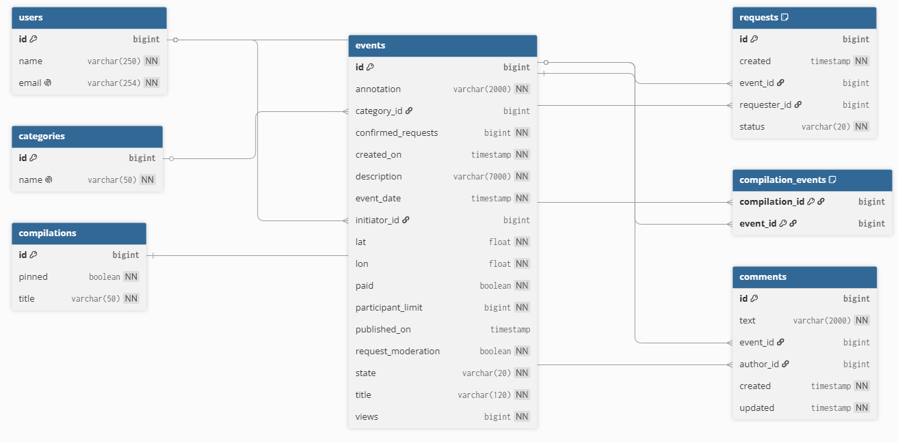

# Приложение Explore with me

https://github.com/Victoriya17/java-explore-with-me/pull/4

## Схема базы данных


## Описание сущностей 
### users

- Добавление пользователя с указанием его id, уникального адреса электронной почты и имени.

### categories

- Список категорий для группировки событий (например, «Концерты», «Кино»). Название категории уникально.

### events

- Добавление события с указанием его id, аннотации, категории, даты проведения, описания, инициатора (пользователя), геокоординат (lat, lon), стоимости (paid), лимита участников, статуса модерации и количества просмотров.

### requests

- Заявки пользователей на участие в событиях. Объединяет id события и id запрашивающего пользователя со статусом заявки.

### compilations

- Подборки событий, которые можно закреплять на главной странице (флаг pinned) с указанием названия подборки.

### compilation_events

- Промежуточная таблица для связи «многие-ко-многим», объединяющая id подборки и id входящих в неё событий.

### comments

- Текст комментария, привязанный к конкретному событию и конкретному автору (пользователю), с фиксацией времени создания и обновления.

## Примеры запросов для основных операций приложения на языке SQL для Events:

1) Регистрация нового пользователя — createUser():
   ```sql
   -- Шаг 1: Проверка уникальности email в БД перед сохранением
   SELECT id, name, email FROM users WHERE email = {request.getEmail()};

   -- Шаг 2: Вставка новой записи, если email свободен
   INSERT INTO users (name, email) 
   VALUES ({request.getName()}, {request.getEmail()});
   ```

2) Создание новой категории — createCategory():
   ```sql
   INSERT INTO categories (name) 
   VALUES ({request.getName()});
   ```

3) Создание нового события пользователем — createEvent():
   ```sql
   INSERT INTO events (annotation, category_id, confirmed_requests, created_on, description, event_date, initiator_id, lat, lon, paid, participant_limit, request_moderation, state, title, views)
   VALUES ({request.getAnnotation()}, {request.getCategory()}, 0, NOW(), {request.getDescription()}, {request.getEventDate()}, {userId}, {request.getLocation().getLat()}, {request.getLocation().getLon()}, {request.getPaid()}, {request.getParticipantLimit()}, {request.getRequestModeration()}, 'PENDING', {request.getTitle()}, 0);
   ```

4) Добавление комментария к событию — createComment():
   ```sql
   -- Шаг 1: Проверка, что событие существует и опубликовано
   SELECT state FROM events WHERE id = {request.getEventId()};

   -- Шаг 2: Сохранение комментария с привязкой к событию и автору
   INSERT INTO comments (text, event_id, author_id, created, updated) 
   VALUES ({request.getText()}, {request.getEventId()}, {userId}, NOW(), NOW());
   ```

5) Создание подборки событий (связь многие-ко-многим) — createCompilation():
   ```sql
   -- Шаг 1: Создание самой подборки (по умолчанию pinned = false, если не передано)
   INSERT INTO compilations (pinned, title) 
   VALUES (COALESCE({request.getPinned()}, FALSE), {request.getTitle()});

   -- Шаг 2: Привязка списка событий к созданной подборке
   INSERT INTO compilation_events (compilation_id, event_id) 
   VALUES ({compilation_id}, {event_id_1}), ({compilation_id}, {event_id_2});
   ```

6) Изменение статуса заявок на участие в событии — updateStatusEvent():
   ```sql
   -- Перевод выбранных заявок в статус подтвержденных
   UPDATE requests SET status = 'CONFIRMED' WHERE id IN ({request_ids});

   -- Синхронизация счетчика подтвержденных участников в таблице событий
   UPDATE events SET confirmed_requests = confirmed_requests + {count} WHERE id = {eventId};
   ```

---

### Технологический стек

*   Платформа и сборка: Java 21 (Amazon Corretto), Maven (Мультимодульный проект: основной сервис `service` и сервис статистики `stats`)
*   Фреймворки и спецификации: Spring Boot 3.3.2, Spring Data JPA, Spring Web, Jakarta Persistence API
*   База данных: PostgreSQL (с разделением на изолированные БД для основного сервиса и статистики)
*   Валидация и сериализация: Jakarta Validation API, Jackson
*   Качество кода и метрики (QA/CI):
    *   Checkstyle — статический анализ кода на соответствие стандартам оформления.
    *   SpotBugs — автоматический поиск потенциальных багов и уязвимостей в байт-коде.
    *   JaCoCo (Java Code Coverage) — плагин для генерации отчетов и контроля покрытия кода юнит-тестами.
*   Утилиты: Lombok

### Планы по доработке
* Добавить тесты
* Добавить фичи
